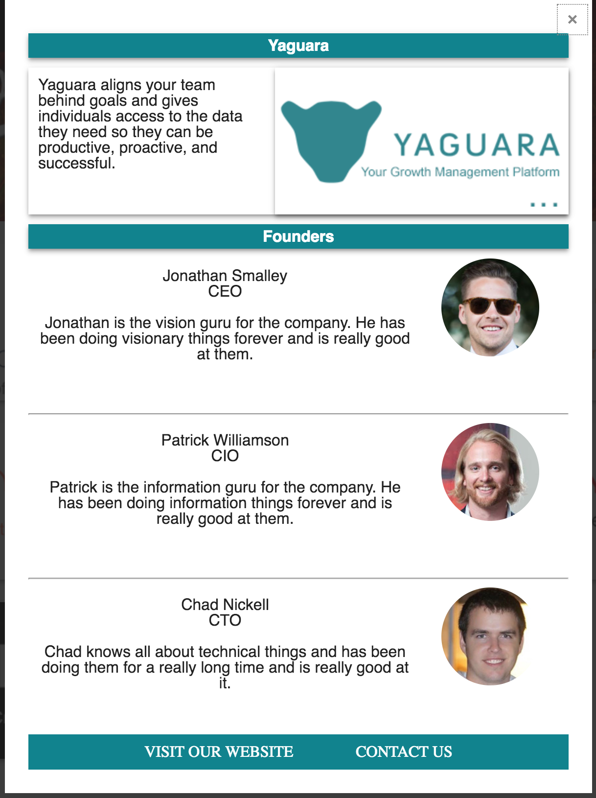
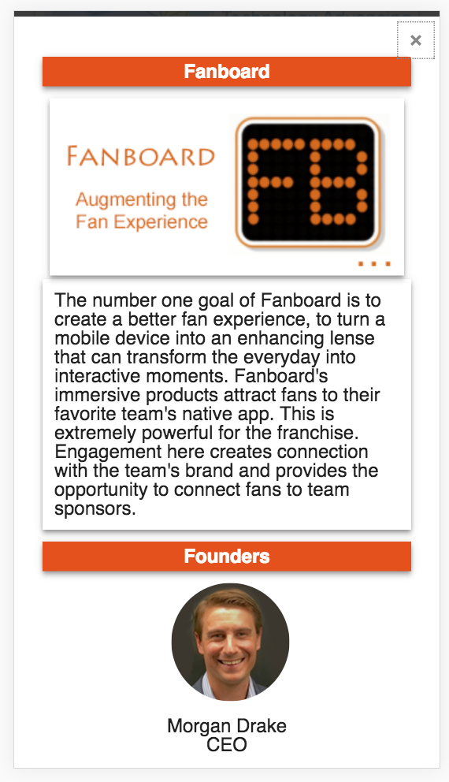

# Boomtown-Showcase

Welcome to the Boomtown Cohort Showcase!

To view the running site, please visit smooth-current.surge.sh.  

The purpose of this site is to provide attendees of Boomtown Accelerator's Demo Day with information on all the companies in the current cohort.  The initial screen provides an overview of all the company logos and taglines, and it allows the user an opportunity to mark their favorites in case they want to be sure to get in touch with them after the demo day.  (The favorites are kept in local storage.)  This main screen is responsive to three different screen sizes:

The user can click on any of the company cards to get more information about that company.  This info includes a description of the company's mission, a list and description of its founders, a link to its website, and an email link for more information.  This info card is also responsive:

To install this code, fork and clone and npm install.  You can run unit tests by running live-server in the test directory; the tests are in the tests.js file.  You can run browser tests by running casperjs casper_tests.js (just verifies the page title) and casperjs test casper_tests_really.js (checks for the presence of the "company-row" browser element).
